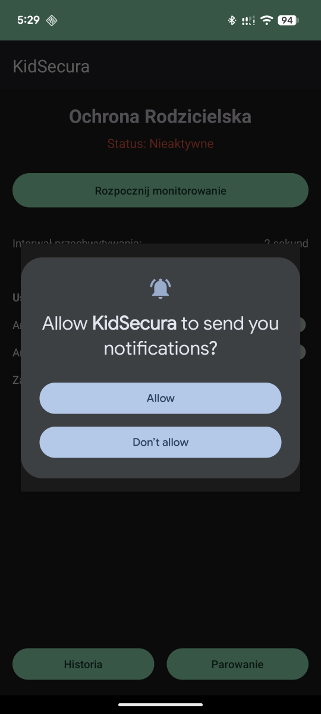
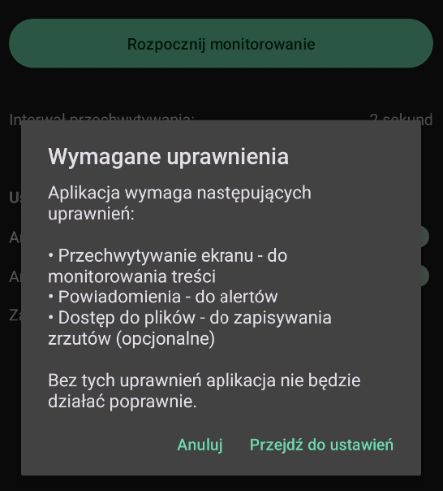
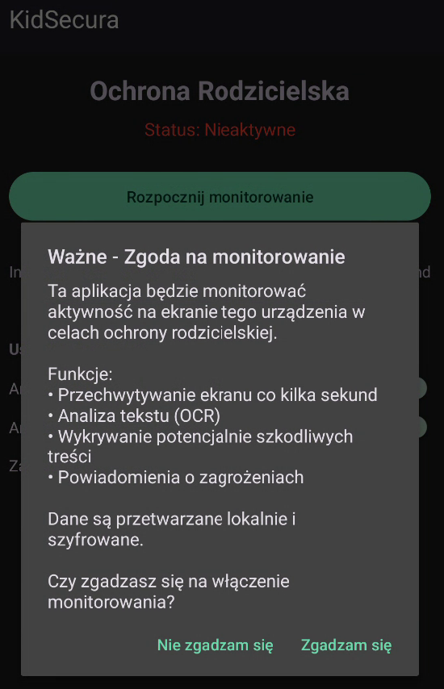

# kidsecura
Aplikacja Android do monitorowania aktywności dzieci i przeciwdziałania przemocy 


# Aplikacja Ochrony Rodzicielskiej - MVP







## 📱 Opis projektu

Aplikacja Android do monitorowania aktywności dzieci na urządzeniu mobilnym. Wykorzystuje MediaProjection API do przechwytywania ekranu, ML Kit do OCR oraz modele TensorFlow Lite do wykrywania potencjalnie szkodliwych treści.

## ⚠️ Ważne informacje prawne

- **Wymaga zgody użytkownika** - aplikacja musi uzyskać jawną zgodę na przechwytywanie ekranu
- **Tylko do celów ochrony rodzicielskiej** - używaj zgodnie z lokalnym prawem
- **Przetwarzanie lokalne** - domyślnie dane są analizowane lokalnie, bez wysyłania do chmury
- **Szyfrowanie danych** - wszystkie zapisane dane powinny być szyfrowane

## 🚀 Funkcje MVP

### Zrealizowane:
- ✅ Przechwytywanie ekranu co 2-10 sekund (konfigurowalne)
- ✅ Crop dolnej połowy ekranu (opcjonalne)
- ✅ OCR - ekstrakcja tekstu z obrazu (Google ML Kit)
- ✅ Wykrywanie słów kluczowych związanych z przemocą, cyberprzemocą, groomingiem
- ✅ Analiza wizualna (podstawowa heurystyka kolorów)
- ✅ Lokalna baza danych zdarzeń (Room)
- ✅ Powiadomienia push o wykrytych zagrożeniach
- ✅ Panel historii zdarzeń
- ✅ Oznaczanie fałszywych alarmów

### Do zrobienia:
- 🔲 Integracja z prawdziwym modelem TFLite do wykrywania przemocy
- 🔲 Backend do synchronizacji między urządzeniami
- 🔲 Panel rodzica (web/druga aplikacja)
- 🔲 Zaawansowane reguły i progi wykrywania
- 🔲 Szyfrowanie end-to-end
- 🔲 Integracja z LLM do analizy kontekstowej

## 📋 Wymagania

- Android 7.0 (API 24) minimum, zalecane Android 10+ (API 29+)
- Kotlin 1.8+
- Android Studio Hedgehog lub nowszy

## 🛠️ Instalacja

### 1. Sklonuj repozytorium
```bash
git clone [your-repo-url]
cd parental-control-mvp
```

### 2. Szybka instalacja (Makefile)

Projekt zawiera Makefile do łatwej automatyzacji zadań:

```bash
# Pełna instalacja (pobierz wrapper + zależności)
make install

# Lub krok po kroku:
make setup      # Pobierz gradle-wrapper.jar
make build      # Zbuduj projekt
make run        # Uruchom na urządzeniu/emulatorze
```

**Wszystkie dostępne komendy:**
```bash
make help       # Pokaż wszystkie dostępne komendy
make doctor     # Sprawdź środowisko (Java, SDK, ADB)
make clean      # Wyczyść projekt
make test       # Uruchom testy
make release    # Zbuduj APK release
make devices    # Pokaż podłączone urządzenia
```

### 3. Konfiguracja projektu

Otwórz projekt w Android Studio i zsynchronizuj Gradle.

### 4. Dodanie modelu TFLite (opcjonalne)

Jeśli masz model wykrywania przemocy:
1. Umieść plik `.tflite` w folderze `app/src/main/assets/`
2. Nazwij go `violence_detection_model.tflite`
3. Upewnij się, że model przyjmuje obrazy 224x224x3

### 5. Konfiguracja uprawnień

Aplikacja automatycznie poprosi o wymagane uprawnienia przy pierwszym uruchomieniu.

## 📱 Struktura projektu

```
app/
├── src/main/java/com/parentalcontrol/mvp/
│   ├── MainActivity.kt                 # Główny ekran aplikacji
│   ├── EventHistoryActivity.kt        # Historia zdarzeń
│   ├── service/
│   │   └── ScreenCaptureService.kt    # Serwis przechwytywania ekranu
│   ├── analyzer/
│   │   └── ContentAnalyzer.kt         # Analiza treści (OCR + ML)
│   ├── data/
│   │   ├── MonitoringEvent.kt        # Model danych
│   │   ├── EventDao.kt               # DAO dla Room
│   │   └── MonitoringDatabase.kt     # Baza danych Room
│   └── utils/
│       ├── PreferencesManager.kt     # Zarządzanie ustawieniami
│       ├── ImageUtils.kt             # Narzędzia do obrazów
│       └── NotificationHelper.kt     # Powiadomienia
├── res/
│   ├── layout/                       # Layouty XML
│   └── values/                       # Zasoby (kolory, stringi)
└── AndroidManifest.xml              # Manifest aplikacji
```

## 🔧 Konfiguracja i użycie

### Pierwsze uruchomienie

1. **Instalacja na urządzeniu dziecka**
   - Zainstaluj aplikację
   - Uruchom i przejdź przez proces konfiguracji
   - Zaakceptuj wszystkie wymagane uprawnienia

2. **Konfiguracja monitorowania**
   - Ustaw interwał przechwytywania (2-10 sekund)
   - Wybierz czy analizować cały ekran czy tylko dolną połowę
   - Zdecyduj czy zapisywać zrzuty ekranu

3. **Rozpoczęcie monitorowania**
   - Kliknij "Rozpocznij monitorowanie"
   - Zaakceptuj systemowy dialog MediaProjection
   - Aplikacja działa w tle jako Foreground Service

### Panel rodzica

W MVP historia zdarzeń jest dostępna bezpośrednio w aplikacji:
- Kliknij "Historia" aby zobaczyć wykryte zdarzenia
- Filtry: Wszystkie, Nieprzejrzane, Dzisiaj, Ostatni tydzień
- Kliknij na zdarzenie aby zobaczyć szczegóły
- Oznacz jako przejrzane lub fałszywy alarm

## 🔐 Bezpieczeństwo i prywatność

### Implementowane zabezpieczenia:
- ✅ Analiza lokalna (domyślnie bez chmury)
- ✅ Automatyczne usuwanie starych zrzutów (>7 dni)
- ✅ Wymuszenie zgody użytkownika na każdą sesję
- ✅ Opcja wyłączenia zapisywania zrzutów

### Zalecenia dodatkowe:
- 🔲 Implementuj szyfrowanie bazy danych (SQLCipher)
- 🔲 Dodaj PIN/biometrię do aplikacji rodzica
- 🔲 Ogranicz dostęp do historii tylko dla sparowanego rodzica
- 🔲 Implementuj secure channel dla komunikacji rodzic-dziecko

## 🧪 Testowanie

### Testy manualne:
1. Otwórz aplikację z potencjalnie szkodliwą treścią
2. Poczekaj na analizę (2-10 sekund)
3. Sprawdź czy pojawiło się powiadomienie
4. Zweryfikuj zdarzenie w historii

### Słowa kluczowe testowe:
- Przemoc: "zabić", "pobić", "zniszczyć"
- Cyberprzemoc: "nienawidzę", "idiota", "głupi"
- Grooming: "tajemnica", "nie mów", "spotkajmy się"

## 📊 Wydajność

### Zużycie zasobów (przybliżone):
- **CPU**: 5-15% podczas przechwytywania
- **RAM**: 50-150 MB
- **Bateria**: ~5-10% na godzinę aktywnego monitorowania
- **Miejsce**: <100 MB (bez zapisywania zrzutów)

### Optymalizacje:
- Resize obrazów przed analizą (480px szerokości)
- Crop tylko dolna połowa ekranu
- Lokalny cache wyników analizy
- Automatyczne czyszczenie starych danych

## 🐛 Znane problemy

1. **MediaProjection kończy się przy blokowaniu ekranu**
   - Rozwiązanie: Restart usługi po odblokowaniu

2. **False positives przy grach/filmach**
   - Rozwiązanie: Ręczne oznaczanie jako fałszywe alarmy

3. **Wysokie zużycie baterii**
   - Rozwiązanie: Zwiększ interwał przechwytywania

## 📚 Zależności

```gradle
dependencies {
    // Core Android
    implementation 'androidx.core:core-ktx:1.12.0'
    implementation 'androidx.appcompat:appcompat:1.6.1'
    implementation 'com.google.android.material:material:1.11.0'
    
    // Room Database
    implementation 'androidx.room:room-runtime:2.6.1'
    implementation 'androidx.room:room-ktx:2.6.1'
    
    // ML Kit OCR
    implementation 'com.google.mlkit:text-recognition:16.0.0'
    
    // TensorFlow Lite
    implementation 'org.tensorflow:tensorflow-lite:2.14.0'
    
    // Coroutines
    implementation 'org.jetbrains.kotlinx:kotlinx-coroutines-android:1.7.3'
}
```

## 🔄 Rozwój projektu

### Następne kroki:
1. **Backend API** - synchronizacja między urządzeniami
2. **Prawdziwy model ML** - trenowanie modelu wykrywania przemocy
3. **Panel web rodzica** - dostęp przez przeglądarkę
4. **Integracja z LLM** - analiza kontekstowa (np. z modelami SpeakLeash/Sójka)
5. **Więcej typów detekcji** - samookaleczanie, narkotyki, etc.

## 📄 Licencja

Ten projekt jest dostarczany jako przykład edukacyjny. Używaj odpowiedzialnie i zgodnie z lokalnym prawem.

## ⚖️ Zastrzeżenia prawne

Ta aplikacja jest przeznaczona wyłącznie do legalnego nadzoru rodzicielskiego. Użytkownik ponosi pełną odpowiedzialność za zgodność z lokalnymi przepisami dotyczącymi prywatności i monitoringu. Nie używaj tej aplikacji do nielegalnego szpiegowania lub naruszania prywatności.

## 📚 Przydatne komendy

### Używając Makefile (rekomendowane):
```bash
make build              # Zbuduj projekt
make test               # Uruchom testy
make clean              # Wyczyść projekt
make run                # Uruchom aplikację
make release            # Zbuduj APK release
```

### Lub bezpośrednio z Gradle:
```bash
./gradlew build
./gradlew test
./gradlew clean
./gradlew assembleRelease
```